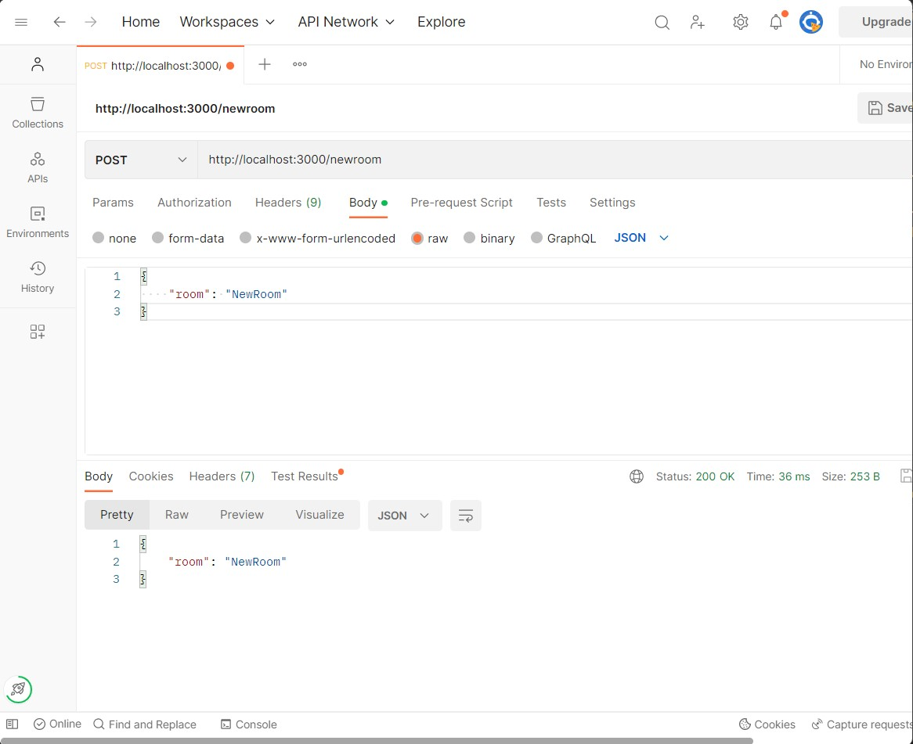

# ChatRoom

Simple chatroom app

##### Description

_An detailed description of what the chatApp does - (both outside and inside)_

* This was made with socket.io, Json, ejs and postman (NodeJs)
(dependencies bellow)

* Main page gives you a list of "rooms" to choose from, once you piked a room, clicked on it the room wil pop up and you see the conversation right away, it will also notify that you have joined the room, you can start to write and it will be saved into a json file.

* Add rooms
 - you can add rooms, go to postman type the port localhost:3000/newroom and POST a new room to use:

 example:
 

This will create a new room as you can see in rooms.json file and on the main page.
The new room will also have a new json file (with the name of the room) as you can see in the data folder. where all the messages will be saved.

### Dependencies

_install with npm install_

- ejs: ^3.1.9,
- express: ^4.18.2,
- socket.io: ^4.6.1

#### How to start
 
Type in: node index.js in the terminal and the ChatApp will be awailable at your http://localhost:3000/

## Contributing
ME :) Yes me :)
**Signed: Janne Marie Tvetene**

